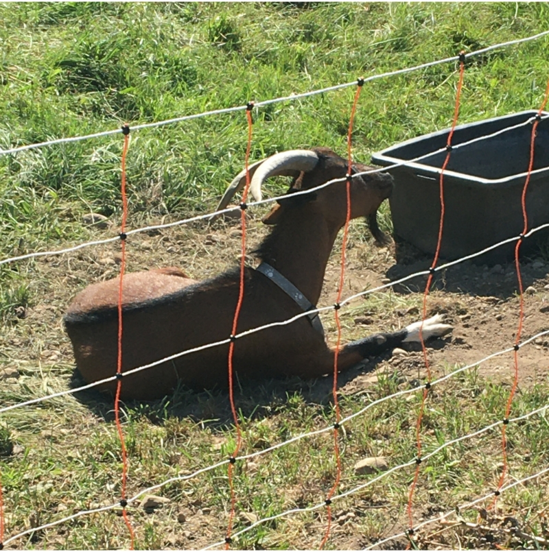
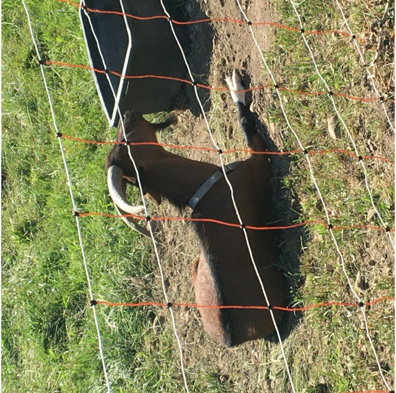
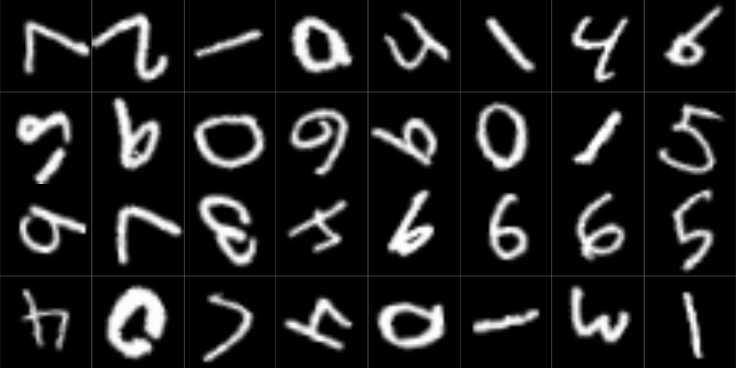

```{r setup, include=FALSE}
knitr::opts_chunk$set(echo = TRUE, eval = FALSE, fig.width = 6, fig.height = 6)
```

Convolutional neural networks (CNNs) are great -- they're able to detect features in an image no matter where. Well, not exactly. They're not indifferent to just any kind of movement. Shifting up or down, or left or right, is fine; rotating around an axis is not. That's because of how convolution works: traverse by row, then traverse by column (or the other way round). If we want "more" (e.g., successful detection of an upside-down object), we need to extend convolution to an operation that is *rotation-equivariant*. An operation that is *equivariant* to some type of action will not only register the moved feature per se, but also, keep track of which concrete action made it appear where it is.

**This is the second post in a series that introduces group-equivariant CNNs (GCNNs)***.* The [first](https://blogs.rstudio.com/ai/posts/2023-03-09-group-equivariant-cnn-1/) was a high-level introduction to why we'd want them, and how they work. There, we introduced the key player, the symmetry group, which specifies what kinds of transformations are to be treated equivariantly. If you haven't, please take a look at that post first, since here I'll make use of terminology and concepts it introduced.

Today, we code a simple GCNN from scratch. Code and presentation tightly follow a [notebook](https://github.com/phlippe/uvadlc_notebooks/blob/master/docs/tutorial_notebooks/DL2/Geometric_deep_learning/tutorial1_regular_group_convolutions.ipynb) provided as part of University of Amsterdam's 2022 [Deep Learning Course](https://uvadl2c.github.io/). They can't be thanked enough for making available such excellent learning materials.

In what follows, my intent is to explain the general thinking, and how the resulting architecture is built up from smaller modules, each of which is assigned a clear purpose. For that reason, I won't reproduce all the code here; instead, I'll make use of the package [`gcnn`](https://github.com/skeydan/gcnn). Its methods are heavily annotated; so to see some details, don't hesitate to look at the code.

As of today, `gcnn` implements one symmetry group: $C_4$, the one that serves as a running example throughout post one. It is straightforwardly extensible, though, making use of class hierarchies throughout.

## Step 1: The symmetry group $C_4$

In coding a GCNN, the first thing we need to provide is an implementation of the symmetry group we'd like to use. Here, it is $C_4$, the four-element group that rotates by 90 degrees.

We can ask `gcnn` to create one for us, and inspect its elements.

```{r}
# remotes::install_github("skeydan/gcnn")
library(gcnn)
library(torch)

C_4 <- CyclicGroup(order = 4)
elems <- C_4$elements()
elems
```

    torch_tensor
     0.0000
     1.5708
     3.1416
     4.7124
    [ CPUFloatType{4} ]

Elements are represented by their respective rotation angles: $0$, $\frac{\pi}{2}$, $\pi$, and $\frac{3 \pi}{2}$.

Groups are aware of the identity, and know how to construct an element's inverse:

```{r}
C_4$identity

g1 <- elems[2]
C_4$inverse(g1)
```

    torch_tensor
     0
    [ CPUFloatType{1} ]

    torch_tensor
    4.71239
    [ CPUFloatType{} ]

Here, what we care about most is the group elements' *action*. Implementation-wise, we need to distinguish between them acting on each other, and their action on the vector space $\mathbb{R}^2$, where our input images live. The former part is the easy one: It may simply be implemented by adding angles. In fact, this is what `gcnn` does when we ask it to let `g1` act on `g2`:

```{r}
g2 <- elems[3]

# in C_4$left_action_on_H(), H stands for the symmetry group
C_4$left_action_on_H(torch_tensor(g1)$unsqueeze(1), torch_tensor(g2)$unsqueeze(1))
```

    torch_tensor
     4.7124
    [ CPUFloatType{1,1} ]

What's with the `unsqueeze()`s? Since $C_4$'s ultimate *raison d'être* is to be part of a neural network, `left_action_on_H()` works with batches of elements, not scalar tensors.

Things are a bit less straightforward where the group action on $\mathbb{R}^2$ is concerned. Here, we need the concept of a [group representation](https://en.wikipedia.org/wiki/Group_representation). This is an involved topic, which we won't go into here. In our current context, it works about like this: We have an input signal, a tensor we'd like to operate on in some way. (That "some way" will be convolution, as we'll see soon.) To render that operation group-equivariant, we first have the representation apply the *inverse* group action to the input. That accomplished, we go on with the operation as though nothing had happened.

To give a concrete example, let's say the operation is a measurement. Imagine a runner, standing at the foot of some mountain trail, ready to run up the climb. We'd like to record their height. One option we have is to take the measurement, then let them run up. Our measurement will be as valid up the mountain as it was down here. Alternatively, we might be polite and not make them wait. Once they're up there, we ask them to come down, and when they're back, we measure their height. The result is the same: Body height is equivariant (more than that: invariant, even) to the action of running up or down. (Of course, height is a pretty dull measure. But something more interesting, such as heart rate, would not have worked so well in this example.)

Returning to the implementation, it turns out that group actions are encoded as matrices. There is one matrix for each group element. For $C_4$, the so-called *standard* representation is a rotation matrix:

$$
\begin{bmatrix} \cos(\theta) & -\sin(\theta) \\ \sin(\theta) & \cos(\theta) \end{bmatrix}
$$

In `gcnn`, the function applying that matrix is `left_action_on_R2()`. Like its sibling, it is designed to work with batches (of group elements as well as $\mathbb{R}^2$ vectors). Technically, what it does is rotate the grid the image is defined on, and then, re-sample the image. To make this more concrete, that method's code looks about as follows.

Here is a goat.

```{r}
img_path <- system.file("imgs", "z.jpg", package = "gcnn")
img <- torchvision::base_loader(img_path) |> torchvision::transform_to_tensor()
img$permute(c(2, 3, 1)) |> as.array() |> as.raster() |> plot()
```

```{r, echo=FALSE, eval=TRUE, fig.alt = "A goat sitting comfortably on a meadow."}

```

First, we call `C_4$left_action_on_R2()` to rotate the grid.

```{r}
# Grid shape is [2, 1024, 1024], for a 2d, 1024 x 1024 image.
img_grid_R2 <- torch::torch_stack(torch::torch_meshgrid(
    list(
      torch::torch_linspace(-1, 1, dim(img)[2]),
      torch::torch_linspace(-1, 1, dim(img)[3])
    )
))

# Transform the image grid with the matrix representation of some group element.
transformed_grid <- C_4$left_action_on_R2(C_4$inverse(g1)$unsqueeze(1), img_grid_R2)

```

Second, we re-sample the image on the transformed grid. The goat now looks up to the sky.

```{r}
transformed_img <- torch::nnf_grid_sample(
  img$unsqueeze(1), transformed_grid,
  align_corners = TRUE, mode = "bilinear", padding_mode = "zeros"
)

transformed_img[1,..]$permute(c(2, 3, 1)) |> as.array() |> as.raster() |> plot()
```

```{r, echo=FALSE, eval=TRUE, fig.alt = "Same goat, rotated up by 90 degrees."}

```

## Step 2: The lifting convolution

We want to make use of existing, efficient `torch` functionality as much as possible. Concretely, we want to use `nn_conv2d()`. What we need, though, is a convolution kernel that's equivariant not just to translation, but also to the action of $C_4$. This can be achieved by having one kernel for each possible rotation.

Implementing that idea is exactly what `LiftingConvolution` does. The principle is the same as before: First, the grid is rotated, and then, the kernel (weight matrix) is re-sampled to the transformed grid.

Why, though, call this a *lifting convolution*? The usual convolution kernel operates on $\mathbb{R}^2$; while our extended version operates on combinations of $\mathbb{R}^2$ and $C_4$. In math speak, it has been *lifted* to the [semi-direct product](https://en.wikipedia.org/wiki/Semidirect_product) $\mathbb{R}^2\rtimes C_4$.

```{r}
lifting_conv <- LiftingConvolution(
    group = CyclicGroup(order = 4),
    kernel_size = 5,
    in_channels = 3,
    out_channels = 8
  )

x <- torch::torch_randn(c(2, 3, 32, 32))
y <- lifting_conv(x)
y$shape
```

    [1]  2  8  4 28 28

Since, internally, `LiftingConvolution` uses an additional dimension to realize the product of translations and rotations, the output is not four-, but five-dimensional.

## Step 3: Group convolutions

Now that we're in "group-extended space", we can chain a number of layers where both input and output are *group convolution* layers. For example:

```{r}
group_conv <- GroupConvolution(
  group = CyclicGroup(order = 4),
    kernel_size = 5,
    in_channels = 8,
    out_channels = 16
)

z <- group_conv(y)
z$shape
```

    [1]  2 16  4 24 24

All that remains to be done is package this up. That's what `gcnn::GroupEquivariantCNN()` does.

## Step 4: Group-equivariant CNN

We can call `GroupEquivariantCNN()` like so.

```{r}
cnn <- GroupEquivariantCNN(
    group = CyclicGroup(order = 4),
    kernel_size = 5,
    in_channels = 1,
    out_channels = 1,
    num_hidden = 2, # number of group convolutions
    hidden_channels = 16 # number of channels per group conv layer
)

img <- torch::torch_randn(c(4, 1, 32, 32))
cnn(img)$shape
```

    [1] 4 1

At casual glance, this `GroupEquivariantCNN` looks like any old CNN ... weren't it for the `group` argument.

Now, when we inspect its output, we see that the additional dimension is gone. That's because after a sequence of group-to-group convolution layers, the module projects down to a representation that, for each batch item, retains channels only. It thus averages not just over locations -- as we normally do -- but over the group dimension as well. A final linear layer will then provide the requested classifier output (of dimension `out_channels`).

And there we have the complete architecture. It is time for a real-world(*ish*) test.

## Rotated digits!

The idea is to train two convnets, a "normal" CNN and a group-equivariant one, on the usual MNIST training set. Then, both are evaluated on an augmented test set where each image is randomly rotated by a continuous rotation between 0 and 360 degrees. We don't expect `GroupEquivariantCNN` to be "perfect" -- not if we equip with $C_4$ as a symmetry group. Strictly, with $C_4$, equivariance extends over four positions only. But we do hope it will perform significantly better than the shift-equivariant-only standard architecture.

First, we prepare the data; in particular, the augmented test set.

```{r}
dir <- "/tmp/mnist"

train_ds <- torchvision::mnist_dataset(
  dir,
  download = TRUE,
  transform = torchvision::transform_to_tensor
)

test_ds <- torchvision::mnist_dataset(
  dir,
  train = FALSE,
  transform = function(x) {
    x |>
      torchvision::transform_to_tensor() |>
      torchvision::transform_random_rotation(
        degrees = c(0, 360),
        resample = 2,
        fill = 0
      )
  }
)

train_dl <- dataloader(train_ds, batch_size = 128, shuffle = TRUE)
test_dl <- dataloader(test_ds, batch_size = 128)
```

How does it look?

```{r}
test_images <- coro::collect(
  test_dl, 1
)[[1]]$x[1:32, 1, , ] |> as.array()

par(mfrow = c(4, 8), mar = rep(0, 4), mai = rep(0, 4))
test_images |>
  purrr::array_tree(1) |>
  purrr::map(as.raster) |>
  purrr::iwalk(~ {
    plot(.x)
  })
```

```{r, echo=FALSE, eval=TRUE, fig.alt = "32 digits, rotated randomly."}

```

We first define and train a conventional CNN. It is as similar to `GroupEquivariantCNN()`, architecture-wise, as possible, and is given twice the number of hidden channels, so as to have comparable capacity overall.

```{r}
 default_cnn <- nn_module(
   "default_cnn",
   initialize = function(kernel_size, in_channels, out_channels, num_hidden, hidden_channels) {
     self$conv1 <- torch::nn_conv2d(in_channels, hidden_channels, kernel_size)
     self$convs <- torch::nn_module_list()
     for (i in 1:num_hidden) {
       self$convs$append(torch::nn_conv2d(hidden_channels, hidden_channels, kernel_size))
     }
     self$avg_pool <- torch::nn_adaptive_avg_pool2d(1)
     self$final_linear <- torch::nn_linear(hidden_channels, out_channels)
   },
   forward = function(x) {
     x <- x |>
       self$conv1() |>
       (\(.) torch::nnf_layer_norm(., .$shape[2:4]))() |>
       torch::nnf_relu()
     for (i in 1:(length(self$convs))) {
       x <- x |>
         self$convs[[i]]() |>
         (\(.) torch::nnf_layer_norm(., .$shape[2:4]))() |>
         torch::nnf_relu()
     }
     x <- x |>
       self$avg_pool() |>
       torch::torch_squeeze() |>
       self$final_linear()
     x
   }
 )

fitted <- default_cnn |>
    luz::setup(
      loss = torch::nn_cross_entropy_loss(),
      optimizer = torch::optim_adam,
      metrics = list(
        luz::luz_metric_accuracy()
      )
    ) |>
    luz::set_hparams(
      kernel_size = 5,
      in_channels = 1,
      out_channels = 10,
      num_hidden = 4,
      hidden_channels = 32
    ) %>%
    luz::set_opt_hparams(lr = 1e-2, weight_decay = 1e-4) |>
    luz::fit(train_dl, epochs = 10, valid_data = test_dl) 

```

    Train metrics: Loss: 0.0498 - Acc: 0.9843
    Valid metrics: Loss: 3.2445 - Acc: 0.4479

Unsurprisingly, accuracy on the test set is not that great.

Next, we train the group-equivariant version.

```{r}
fitted <- GroupEquivariantCNN |>
  luz::setup(
    loss = torch::nn_cross_entropy_loss(),
    optimizer = torch::optim_adam,
    metrics = list(
      luz::luz_metric_accuracy()
    )
  ) |>
  luz::set_hparams(
    group = CyclicGroup(order = 4),
    kernel_size = 5,
    in_channels = 1,
    out_channels = 10,
    num_hidden = 4,
    hidden_channels = 16
  ) |>
  luz::set_opt_hparams(lr = 1e-2, weight_decay = 1e-4) |>
  luz::fit(train_dl, epochs = 10, valid_data = test_dl)

```

    Train metrics: Loss: 0.1102 - Acc: 0.9667
    Valid metrics: Loss: 0.4969 - Acc: 0.8549

For the group-equivariant CNN, accuracies on test and training sets are a lot closer. That is a nice result! Let's wrap up today's exploit resuming a thought from the first, more high-level post.

## A challenge

Going back to the augmented test set, or rather, the samples of digits displayed, we notice a problem. In row two, column four, there is a digit that "under normal circumstances", should be a 9, but, most probably, is an upside-down 6. (To a human, what suggests this is the squiggle-like thing that seems to be found more often with sixes than with nines.) However, you could ask: does this *have* to be a problem? Maybe the network just needs to learn the subtleties, the kinds of things a human would spot?

The way I view it, it all depends on the context: What really should be accomplished, and how an application is going to be used. With digits on a letter, I'd see no reason why a single digit should appear upside-down; accordingly, full rotation equivariance would be counter-productive. In a nutshell, we arrive at the same canonical imperative advocates of fair, just machine learning keep reminding us of:

> Always think of the way an application is going to be used!

In our case, though, there is another aspect to this, a technical one. `gcnn::GroupEquivariantCNN()` is a simple wrapper, in that its layers all make use of the same symmetry group. In principle, there is no need to do this. With more coding effort, different groups can be used depending on a layer's position in the feature-detection hierarchy.

Here, let me finally tell you why I chose the goat picture. The goat is seen through a red-and-white fence, a pattern -- slightly rotated, due to the viewing angle -- made up of squares (or edges, if you like). Now, for such a fence, types of rotation equivariance such as that encoded by $C_4$ make a lot of sense. The goat itself, though, we'd rather not have look up to the sky, the way I illustrated $C_4$ action before. Thus, what we'd do in a real-world image-classification task is use rather flexible layers at the bottom, and increasingly restrained layers at the top of the hierarchy.

Thanks for reading!

Photo by <a href="https://unsplash.com/@marjan_blan?utm_source=unsplash&utm_medium=referral&utm_content=creditCopyText">Marjan Blan \| @marjanblan</a> on <a href="https://unsplash.com/photos/kvOnuo8OvN4?utm_source=unsplash&utm_medium=referral&utm_content=creditCopyText">Unsplash</a>
