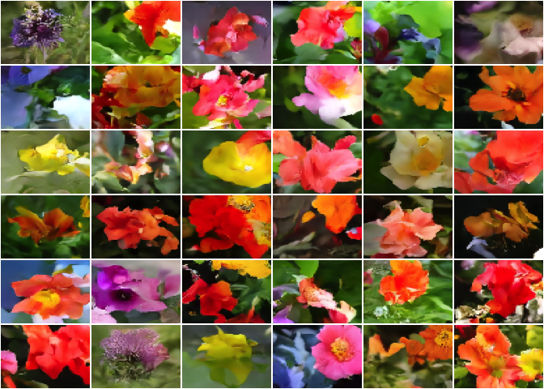

```{r setup, include=FALSE}
knitr::opts_chunk$set(echo = TRUE, eval = FALSE, fig.width = 6, fig.height = 6)
```

#### *A Preamble, sort of*

*As we're writing this -- it's April, 2023 -- it is hard to overstate
the attention going to, the hopes associated with, and the fears
surrounding deep-learning-powered image and text generation. Impacts on
society, politics, and human well-being deserve more than a short,
dutiful paragraph. We thus defer appropriate treatment of this topic to
dedicated publications, and would just like to say one thing: The more
you know, the better; the less you'll be impressed by over-simplifying,
context-neglecting statements made by public figures; the easier it will
be for you to take your own stance on the subject. That said, we begin.*

<br />

In this post, we introduce an R `torch` implementation of *De-noising
Diffusion Implicit Models* (@song2020). The code is on
[GitHub](https://github.com/dfalbel/denoising-diffusion), and comes with
an extensive README detailing everything from mathematical underpinnings
via implementation choices and code organization to model training and
sample generation. Here, we give a high-level overview, situating the
algorithm in the broader context of generative deep learning. Please
feel free to consult the README for any details you're particularly
interested in!

## Diffusion models in context: Generative deep learning

In generative deep learning, models are trained to generate new
exemplars that could likely come from some familiar distribution: the
distribution of landscape images, say, or Polish verse. While diffusion
is all the hype now, the last decade had much attention go to other
approaches, or families of approaches. Let's quickly enumerate some of
the most talked-about, and give a quick characterization.

First, **diffusion models** themselves. Diffusion, the general term,
designates entities (molecules, for example) spreading from areas of
higher concentration to lower-concentration ones, thereby increasing
entropy. In other words, _information is
lost_. In diffusion models, this information loss is intentional: In a
"forward" process, a sample is taken and successively transformed into
(Gaussian, usually) noise. A "reverse" process then is supposed to take
an instance of noise, and sequentially de-noise it until it looks like
it came from the original distribution. For sure, though, we can't
reverse the arrow of time? No, and that's where deep learning comes in:
During the forward process, the network learns what needs to be done for
"reversal".

A totally different idea underlies what happens in GANs, **Generative
Adversarial Networks**. In a GAN we have two agents at play, each trying
to outsmart the other. One tries to generate samples that look as
realistic as could be; the other sets its energy into spotting the
fakes. Ideally, they both get better over time, resulting in the desired
output (as well as a "regulator" who is not bad, but always a step
behind).

Then, there's VAEs: **Variational Autoencoders**. In a VAE, like in a
GAN, there are two networks (an encoder and a decoder, this time).
However, instead of having each strive to minimize their own cost
function, training is subject to a single -- though composite -- loss.
One component makes sure that reconstructed samples closely resemble the
input; the other, that the latent code confirms to pre-imposed
constraints.

Lastly, let us mention **flows** (although these tend to be used for a
different purpose, see next section). A flow is a sequence of
differentiable, invertible mappings from data to some "nice"
distribution, nice meaning "something we can easily sample, or obtain a
likelihood from". With flows, like with diffusion, learning happens
during the forward stage. Invertibility, as well as differentiability,
then assure that we can go back to the input distribution we started
with.

Before we dive into diffusion, we sketch -- *very* informally -- some
aspects to consider when mentally mapping the space of generative
models.

## Generative models: If you wanted to draw a mind map...

Above, I've given rather technical characterizations of the different
approaches: What is the overall setup, what do we optimize for...
Staying on the technical side, we could look at established
categorizations such as likelihood-based vs. not-likelihood-based
models. Likelihood-based models directly parameterize the data
distribution; the parameters are then fitted by maximizing the
likelihood of the data under the model. From the above-listed
architectures, this is the case with VAEs and flows; it is not with
GANs.

But we can also take a different perspective -- that of purpose.
Firstly, are we interested in representation learning? That is, would we
like to condense the space of samples into a sparser one, one that
exposes underlying features and gives hints at useful categorization? If
so, VAEs are the classical candidates to look at.

Alternatively, are we mainly interested in generation, and would like to
synthesize samples corresponding to different levels of coarse-graining?
Then diffusion algorithms are a good choice. It has been shown that

> [...] representations learnt using different noise levels tend to
> correspond to different scales of features: the higher the noise
> level, the larger-scale the features that are captured.[^1]

[^1]: From @dieleman2022diffusion, an excellent high-level introduction
    to diffusion models.

As a final example, what if we aren't interested in synthesis, but would
like to assess if a given piece of data could likely be part of some
distribution? If so, flows might be an option.[^2]

[^2]: For more information on this lesser-used family of algorithms, see
    <https://blog.evjang.com/2018/01/nf1.html>.

## Zooming in: Diffusion models

Just like about every deep-learning architecture, diffusion models
constitute a heterogeneous family. Here, let us just name a few of the
most en-vogue members. [^3]

[^3]: En vogue as of this writing (the usual caveat that comes with
    using qualifiers like this).

When, above, we said that the idea of diffusion models was to
sequentially transform an input into noise, then sequentially de-noise
it again, we left open how that transformation is operationalized. This,
in fact, is one area where rivaling approaches tend to differ.
@abs-2011-13456, for example, make use of a a stochastic differential
equation (SDE) that maintains the desired distribution during the
information-destroying forward phase. In stark contrast, other
approaches, inspired by @ho2020, rely on Markov chains to realize state
transitions. The variant introduced here -- @song2020 -- keeps the same
spirit, but improves on efficiency.

## Our implementation -- overview

The [README](https://github.com/dfalbel/denoising-diffusion) provides a
very thorough introduction, covering (almost) everything from
theoretical background via implementation details to training procedure
and tuning. Here, we just outline a few basic facts.

As already hinted at above, all the work happens during the forward
stage. The network takes two inputs, the images as well as information
about the signal-to-noise ratio to be applied at every step in the
corruption process. That information may be encoded in various ways,
and is then embedded, in some form, into a higher-dimensional space more
conducive to learning. Here is how that could look, for two different types of scheduling/embedding:

```{r, echo=FALSE, eval=TRUE, fig.alt = "One below the other, two sequences where the original flower image gets transformed into noise at differing speed.", out.width="704px", out.height="128px"}
knitr::include_graphics("images/forward.png")
```

Architecture-wise, inputs as well as intended outputs being images, the
main workhorse is a U-Net. It forms part of a top-level model that, for
each input image, creates corrupted versions, corresponding to the noise
rates requested, and runs the U-Net on them. From what is returned, it
tries to deduce the noise level that was governing each instance.
Training then consists in getting those estimates to improve.


Model trained, the reverse process -- image generation -- is
straightforward: It consists in recursive de-noising according to the
(known) noise rate schedule. All in all, the complete process then might look like this:

```{r, echo=FALSE, eval=TRUE, fig.alt = "Step-wise transformation of a flower blossom into noise (row 1) and back.", out.width="704px", out.height="128px"}
knitr::include_graphics("images/reverse.png")
```

Wrapping up, this post, by itself, is really just an invitation. To
find out more, check out the [GitHub
repository](https://github.com/dfalbel/denoising-diffusion/). Should you
need additional motivation to do so, here are some flower images.

```{r, echo=FALSE, eval=TRUE, fig.alt = "A 6x8 arrangement of flower blossoms.", out.height=503, out.width=704}

```

Thanks for reading!
