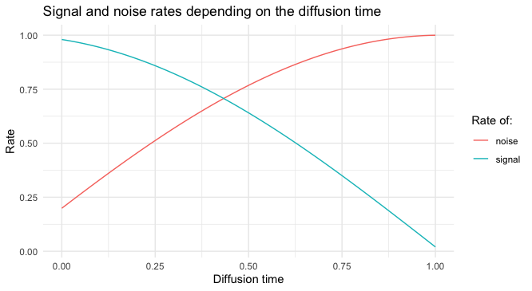

```{r setup, include=FALSE}
knitr::opts_chunk$set(echo = TRUE, eval = FALSE, fig.width = 6, fig.height = 6)
```

If you read the [previous blog post](https://blogs.rstudio.com/ai/posts/2023-04-13-denoising-diffusion/) you might be curious on how the denoising diffusion 
models can be implemented in torch. You might have also read the [README](https://github.com/dfalbel/denoising-diffusion/blob/main/README.md) in the denoising 
diffusion repository, but it doesn't go into much details on it's implemented. In this 
blog post we will try to explain the code and how it relates to formulaes in the 
reference papers.

We are going to use `luz` to train the denoising diffusion model. Using luz allows
us to avoid much of the torch boilerplate code related to supporting training in different
devices like the cpu or the GPU, logging metrics, disabling autograd during evaluation, etc.

However, since we are not building a standard supervised model, we will need to 
implement a custom `step` method.

## Denoising diffusion training overview

We will start with a very high level overview of how denoising diffusion models
are trained. The theoretical explanations will come later as we detail each step.
In very practical terms, denoising diffusion models work in the following way:

```{r fig.cap="Overview of denoising diffusion training procedure", echo=FALSE, eval=TRUE, out.width="100%"}

```

The general idea is to take real images, add Gaussian noise to them. The amount of
noise that is added depends on the step of the diffusion process, but during
training this is sampled. 

A neural network, taking as input the noisy image and the **noise rate**, is trained
to predict the amount of noise for each pixel in the noisy image by minimizing the 
loss (usually the MSE) between the actual sampled noise and the predicted noise.

## Implementing the nn_module

In order to use luz, we need to define a torch `nn_module()`, which contains the
definition of the model we want to train. `nn_module`s in torch requires the user
to implement the `initialize` and `forward` methods. 

In `initialize` we declare the components of that model, what are it's parameters,
layers, etc. In `forward` we describe how the components relate to each other.

We'll start by defining the initialize method. This method will initialize the following
attributes of the model:

* `diffusion`:  the neural network that is used to predict the noise for each pixel
  given the noisy image. To initialize this neural net we need to specify the image
  size and other hyper-parameters like the embeddings size, the widths and depths of
  the neural net blocks. More details on this neural net later. For now, it's suffiencient
  to know that it takes a noisy image and the noise rate as input and tries to predict
  the noise for each pixel.
  
* `schedule`: the schedule determines the amount of noise that should be added to
  the real image depending on the diffusion step we are in. The schedule has a few
  configurations related to how it changes the amount of noise for each step.
  
* `loss`: The loss function used to train the model. The `diffusion` network will
  be trained to minimize that loss.

* `loss_on`: In the diagram from the first section we showed that the neural network
  learns to predict the amount of noise for each pixel, and indeed this seems to lead
  to better results. However, the network could be trained to predict the real image
  and in this case the loss would be computed between the real image and the predicted
  image. This parameter allows us to switch between these two approaches.

The code for defining the initialize method is shown below. Note that this not the
full module code, we are just showing a small portion so it's easier to navigate.

```{r}
diffusion_model <- nn_module(
  initialize = function(image_size, 
                        embedding_dim = 32, 
                        widths = c(32, 64, 96, 128), 
                        block_depth = 2,
                        schedule = NULL,
                        loss = "noise", 
                        loss_on = NULL) {
    
    self$diffusion <- diffusion(image_size, embedding_dim, widths, block_depth)
    
    schedule <- if(is.null(schedule)) 
      diffusion_schedule_config("cosine", 0.02, 0.95)
    
    self$diffusion_schedule <- do.call(diffusion_schedule, schedule)
    self$image_size <- image_size
    self$normalize <- normalize(image_size[1])
    
    self$loss <- if (is.null(loss)) nnf_l1_loss else loss
    self$loss_on <- loss_on
  }
  # ... implementation of the other methods
)
```

We will now define the forward method, which defines how the components initialized
in the above method relate to each other. We start by defining the `denoise` method,
the `forward` method will be just a wrapper around it, but for readability later it's
nice to have a method called `denoise`.

The denoise method takes as input a batch of noisy image (`images` parameter) and
a batch of rates (the amount of noise/signal for each image). It then computes the
predicted real image and the predicted amount of noise. The way it computes depends
on the `loss_on` configuration, i.e. if the neural network is trained to predict the
noise or the image. Given the prediction for one of them, the rates and the noisy images,
it's possible to compute the other. 

In simpler terms, the `denoise` method is responsible for separating the noise and the signal
from noisy images. And since `forward` is just a wrapper around `denoise`, this is what 
happens when we call `model(images, rates)`.

```{r}
diffusion_model <- nn_module(
  # ... other methods
  denoise = function(images, rates) {
    if (self$loss_on == "noise") {
      pred_noises <- self$diffusion(images, rates$noise^2)
      pred_images <- (images - rates$noise * pred_noises) / rates$signal
    } else {
      pred_images <- self$diffusion(images, rates$signal^2)
      pred_noises <- (images - rates$signal * pred_images) / rates$noise
    }

    list(
      pred_noises = pred_noises,
      pred_images = pred_images
    )
  },
  forward = function(images, rates) {
    self$denoise(images, rates)
  }
  # other methods
)
```

We'll now get into how this model is trained, but first a quick introduction on
how to customize the training loop with luz.

## Quick intro to luz custom steps

luz provides different levels of abstraction of the training loop and depending on
the type of model you are implementing, you might one to use one or another.

On the highest level, and the simpler models to implement with luz, are the supervised models.
In this setup, for each batch during training, luz will execute it's **default step** which looks like like the following:

```{r}
loss <- ctx$model$loss(ctx$model(ctx$input), ctx$target)
loss$backward()
ctx$opt$step()
ctx$opt$zero_grad()
```

The `ctx` object in luz is holding the context of that training step, which includes
the model that is being trained, the input and target batches and the optimizer.
You can see more information about the context [here](https://mlverse.github.io/luz/reference/ctx.html).

Users can override the **default step** by implementing the `step` method in their 
`nn_module()`. This is useful when the model in case needs a different procedure
for training than the default supervised procedure. More details on customizing the
`step` can be found [here](https://mlverse.github.io/luz/articles/custom-loop.html#fully-flexible-step).

## Implementing the step

We now implement the custom training step for our module. We want it to take a batch
of input images, successively add noise to them, then train the neural net to
be good at denoising those noisy images by minimizing a loss and applyting gradient descent.

Here's the implementation of `step()`:

```{r}
diffusion_model <- nn_module(
  # ... other methods
  step = function() {
    ctx$input <- images <- ctx$model$normalize(ctx$input)
    
    diffusion_times <- torch_rand(images$shape[1], 1, 1, 1, device = images$device)
    rates <- self$diffusion_schedule(diffusion_times)
    
    ctx$buffers$noises <- noises <- torch_randn_like(images)
    noisy_images <- rates$signal * images + rates$noise * noises
    
    ctx$pred <- ctx$model(noisy_images, rates)
    
    loss <- if (self$loss_on == "noise") {
      self$loss(noises, ctx$pred$pred_noises)
    } else if (self$loss_on == "image") {
      self$loss(images, ctx$pred$pred_images)
    }
    
    if (ctx$training) {
      ctx$opt$zero_grad()
      loss$backward()
      ctx$opt$step()
    }
    
    ctx$loss[[ctx$opt_name]] <- loss$detach()
  }
  # ... other methods
)
```

Note the first 5 lines of code (repeated below), where we add noise to the images.
This is the so called **forward diffusion process*.

The first technical detail here is that luz will make the data available to the
`step()` trough the context, for example, `ctx$input` will contain the batch of 
input images. We first normalize the images, so they have zero mean and a standard 
deviation of 1 channel-wise.

We then sample `diffusion_times` uniformly between 0 and 1. The diffusion time 
represents the current step of the diffusion model. 0 means we are in the begging
of the diffusion process. 1 means that we are in the end of the diffusion process.
During training we randomly select diffusion times so the model sees many different
parts of the diffusion process, later, when we sample images we will start with pure 
noise (i.e. `diffusion_times=1`) and slowly reduce it until it's 0 - which would 
give us a image with no noise added.

The diffusion times are passed to the denoising schedule, which regulates the amount
of noise depending on the diffusion time. We expect the schedule to give higher noise
rates the later we are in the diffusion process, i.e. the closer diffusion times is to
one.

We then sample noises from the standard Normal distribution and combine them with
the original images to create the noisy images - which will be the input to the
neural net. Here another technical detail is that we also save the noises to 
`ctx$buffer$noises`, this is only to allow us to get the noise values in other
methods, for example when using a luz callback.

```{r}
ctx$input <- images <- ctx$model$normalize(ctx$input)
    
diffusion_times <- torch_rand(images$shape[1], 1, 1, 1, device = images$device)
rates <- self$diffusion_schedule(diffusion_times)

ctx$buffers$noises <- noises <- torch_randn_like(images)
noisy_images <- rates$signal * images + rates$noise * noises
```
  
One thing that might be strange at this point is that we said that we successively
add noise to the image for a few diffusion steps, but here, we just add noise once.
The next section gives you the theoretical background that allows us to do it in
just one computation.

## Forward diffusion

As we mentioned in the previous blog post, this process consists of successively 
transforming an input image into noise. In mathematical terms, 
we define $x_0$ is the true image. We then define the distribution of images at 
the **diffusion step** $t$ is:

$$q(x_{t} | x_{t-1}) = \mathcal{N}(x_{t-1} \sqrt{1 - \beta_t}, I\beta_t )$$ 

with $\beta_t \in (0,1)$, the diffusion rate. During training we have to be able 
to sample from sample from $q(x_t | x_0)$. Using the above formula we would need
a `for` loop that successively adds noise, in pseudo code:

```{r}
for (t in 1:n_steps) {
  image[t] <- images[t-1] + beta[t] * torch_randn_like(images[t-1])
}
```

To make computations easier, we reparametrize this as:

$$x_t = \sqrt{\bar{\alpha_t}}x_0 + \sqrt{1-\bar{\alpha_t}}\epsilon$$

with $\epsilon = \mathcal{N}(0, I)$. We define $\bar{\alpha}_t$ with a **schedule** that 
is a strictly decreasing function of $t$ - and also usually defined in terms of $T$ the 
maximum number of diffusion steps - so that $\bar{\alpha}_T$ is very close to 0.

This means that, with a reparametrization trick, we can simplify the code so we don't
need to use the `for` loop, which would also require us to use discrete diffusion times
which complicates further.

## step() continued

We now explain the last few lines of the `step()` method that will execute the 
training procedure. For easier navigation, we will repeat the last lines below.

As we saw earlier, `noisy_images` now contains the noisy images created by adding noise
to them. `rates` is a measure of the noise/signal there's in each image.

We now use `ctx$model()`, which in turns call's `forward` and consequently `denoise`
on the noisy images. This applies the neural network and generates the predictions
for both the real image and the noise.

Next we compute the loss, depending on the `loss_on` configuration, we will compute
it on images or on noise. `step()` in luz is called both during the training and
the validation loop, thus only if `ctx$training` we will update the weights of the
neural net by using the usual torch `zero_grad(); backward(); step()` procedure.

Finally we log the loss in the `ctx$loss` context attribute, which is used by luz
to display the loss in the progress bar and save it in the training history.

```{r}
ctx$pred <- ctx$model(noisy_images, rates)
    
loss <- if (self$loss_on == "noise") {
  self$loss(noises, ctx$pred$pred_noises)
} else if (self$loss_on == "image") {
  self$loss(images, ctx$pred$pred_images)
}

if (ctx$training) {
  ctx$opt$zero_grad()
  loss$backward()
  ctx$opt$step()
}

ctx$loss[[ctx$opt_name]] <- loss$detach()
```

We have now finished the first pass trough the diffusion model and we this overview
we could start training it. But before that, let's dive a little deeper into the
architecture of the neural net that helps separating noise from signal from the
noisy images.

## Neural net architecture

This neural net is basically a [U-Net](https://en.wikipedia.org/wiki/U-Net) (see also previous [blog post](https://blogs.rstudio.com/ai/posts/2019-08-23-unet/)) with a very small change
in how it deals with inputs in order to be able to accommodate the `rates` input.

We chose using a U-Net here as we are trying to learn the distribution of an image
dataset. If a different kind of data were to be used, e.g. text data or tabular data,
we would need a different combination of layers that makes more sense for the data domain.

### Unet

A U-Net is a convolutional neural network that successively downsamples the image resolution while increasing its depth. After a few downsampling blocks, it starts upsampling the representation and decreasing the channels depth. The main idea in U-Net, is that much like Residual Networks, the upsampling blocks take as input both the representation from the previous upsampling block and the representation from a previous downsampling block.

```{r fig.cap="U-Net model", eval = TRUE, echo=FALSE, out.width="50%"}
knitr::include_graphics("https://blogs.rstudio.com/ai/posts/2019-08-23-unet/images/unet.png")
```

Unlike the original U-Net implementation, we use ResNet Blocks in the downsampling and upsampling blocks of the U-Net. Each down or upsampling blocks contain *block_depth* of those ResNet blocks. We also use the [Swish activation](https://en.wikipedia.org/wiki/Swish_function) function. We report those
choises even though we don't think they are necessary for the model performance.

### Sinusoidal embeddings

A sinusoidal embedding [@vaswani2017] is used to encode the diffusion times (or 
the noise variance) into the model. The visualization below shows how diffusion 
times are mapped to the embedding - assuming the dimension size of 32. Each row 
is a embedding vector given the diffusion time. Sinusoidal embedding have nice 
properties, like preserving the relative distances [@kazemnejad2019:pencoding].

```{r fig.cap="Sinusoidal embeddings vector", eval=TRUE, echo=FALSE, out.width="50%"}
knitr::include_graphics("images/sinusoidal-1.png")
```

The noise variance (or the weight of the noise in the resulting noisy image) is 
encoded into a vector which is then upsampled to the same size of the input image.
They are then concatenated in the channels dimension and passed to the U-Net.

### Implementing the architecture

Below we show the code that does this work. This is the neural net module that is
initialized in the `diffusion_model` module in the second section of this article.

We could go into more details on the `unet` and the `sinusoidal_embedding` but we
will leave up to the reader to search for the code in the [GitHub repository](https://github.com/dfalbel/denoising-diffusion).

```{r}
diffusion <- nn_module(
  initialize = function(image_size, embedding_dim = 32, 
                        widths = c(32, 64, 96, 128), block_depth = 2) {
    self$unet <- unet(2*embedding_dim, embedding_dim, widths = widths, block_depth)
    self$embedding <- sinusoidal_embedding(embedding_dim = embedding_dim)

    self$conv <- nn_conv2d(image_size[1], embedding_dim, kernel_size = 1)
    self$upsample <- nn_upsample(size = image_size[2:3])

    self$conv_out <- nn_conv2d(embedding_dim, image_size[1], kernel_size = 1)
    purrr::walk(self$conv_out$parameters, nn_init_zeros_)
  },
  forward = function(noisy_images, noise_variances) {
    embedded_variance <- noise_variances |>
      self$embedding() |>
      self$upsample()

    embedded_image <- noisy_images |>
      self$conv()

    unet_input <- torch_cat(list(embedded_image, embedded_variance), dim = 2)
    unet_output <- unet_input %>%
      self$unet() %>%
      self$conv_out()
  }
)
```

## Schedule

As mentioned earlier, the schedule determines the amount of noise that should be 
added to the real image depending on the diffusion step we are in. For instance,
let's consider the 'cosine' schedule that we use by default.

We implement it as `nn_module()` even though it doesn't have any trainable
'weights'. Technically at `diffusion_time=0`, the signal rate should be zero
and at `diffusion_time=1` it should be 0, however this leads to problems when
adjusting the model, thus we use the `min_signal_rate` and `max_signal_rates` 
that avoids the schedule to return values in the extreme.

```{r}
cosine_schedule <- nn_module(
  initialize = function(min_signal_rate = 0.02, max_signal_rate = 0.98) {
    self$start_angle <- nn_buffer(torch_acos(max_signal_rate))
    self$end_angle <- nn_buffer(torch_acos(min_signal_rate))
  },
  forward = function(diffusion_times) {
    angles <- self$start_angle + diffusion_times*(self$end_angle - self$start_angle)

    list(
      signal = torch_cos(angles),
      noise = torch_sin(angles)
    )
  }
)
```

The graph below shows the values of the signal and noise rates and we progress
in the diffusion process:

```{r, echo=FALSE}
# script to get the plot below
library(torch)
library(tidyverse)
cosine_schedule <- nn_module(
  initialize = function(min_signal_rate = 0.02, max_signal_rate = 0.98) {
    self$start_angle <- nn_buffer(torch_acos(max_signal_rate))
    self$end_angle <- nn_buffer(torch_acos(min_signal_rate))
  },
  forward = function(diffusion_times) {
    angles <- self$start_angle + diffusion_times*(self$end_angle - self$start_angle)
    
    list(
      signal = torch_cos(angles),
      noise = torch_sin(angles)
    )
  }
)

x <- cosine_schedule()
result <- x(seq(0, 1, length.out = 100))

df <- as.data.frame(lapply(result, as.numeric))
df$diffusion_time <- seq(0, 1, length.out = 100)
df %>% 
  pivot_longer(cols = c(signal, noise), "type") %>% 
  ggplot(aes(x = diffusion_time, y = value, color = type)) +
  geom_line() +
  labs(
    title = "Signal and noise rates depending on the diffusion time",
    x = "Diffusion time",
    y = "Rate",
    color = "Rate of:"
  ) +
  theme_minimal()
```

```{r, eval=TRUE, fig.cap="Noise/Signal rates per diffusion time", echo=FALSE, out.width="100%"}

```

The image below illustrates what it means to apply an *amount of noise* to the 
images. We took a real image and added noise to them according to the cosine schedule
(first row) and linear schedule (second row) for lienarly spaced diffusion times ranging
ranging from 0 to 1.

```{r eval=TRUE, layout="l-body-outset", fig.cap="Images transformed by the forward diffusion process at different diffusion times", echo=FALSE, out.height="130px"}

```

## Training the model

We have defined the model training loop in `step()` and the neural net architecture
that will be used to make predictions. We can now train the model using this procedure.

Before training though we need training data. In our experiments we trained the model 
with two different datasets: the [Oxford Pets](https://www.robots.ox.ac.uk/~vgg/data/pets/) 
dataset and the [Oxford Flowers](https://www.robots.ox.ac.uk/~vgg/data/flowers/).

### Dataset

Fortunately those datasets are readily available in the torchdatasets package, thus
we don't need to figure out how to download and read the images from it. We had only
to implement a transform that would center crop and resize the images so they all
have the same size. 

We created a wrapper dataset, that takes either the pets dataset or the flowers dataset
and applies the transforms to the input data. Center cropping the image before resizing
is a good idea for generative models so you preserve the original scale of the image.

```{r}
diffusion_dataset <- dataset(
  "DiffusionDataset",
  initialize = function(dataset, image_size, ...) {

    self$image_size <- image_size

    self$transform <- function(x) {
      img <- x |>
        transform_to_tensor()

      c(ch, height, width) %<-% img$size()
      crop_size <- min(height, width)

      img |>
        transform_center_crop(c(crop_size, crop_size)) |>
        transform_resize(self$image_size)
    }

    self$data <- dataset(
      dir,
      transform = self$transform,
      ...
    )
  },
  .getitem = function(i) {
    self$data[i]
  },
  .length = function() {
    length(self$data)
  }
)
```

For instance, this is called with the pets dataset like so:

```{r}
train_dataset <- diffusion_dataset(
  torchdatasets::oxford_pet_dataset,
  target_type = "species",
  image_size,
  split = "train",
  download = TRUE
)
```

The flowers and pets dataset have return for each item a `list()` with an image
and its target. We will simply ignore the target, as we don't use it when training
our model. We don't show further details about the dataset, feel free to look
at the `datasets.R` file for more details.

### Fitting

A simplified version of the code from `train.R` is shown below. Here we setup the 
model optimizer and set the values for the model and the optimizer hyper-parameters.

```{r}
model <- diffusion_model |>
  setup(
    optimizer = torchopt::optim_adamw
  ) |>
  set_hparams(
    image_size = c(3, 64, 64),
    block_depth = 2,
    loss = torch::nn_mae_loss(),
    widths = c(32, 64, 96, 128),
    embedding_dim = 32,
    schedule = diffusion_schedule_config("cosine", 0.02, 0.95),
    loss_on = "noise"
  ) |>
  set_opt_hparams(lr = 1e-4, weight_decay = 1e-4)
```

We then use `fit` to train the model.

```{r}
train_dataset <- diffusion_dataset(
  torchdatasets::oxford_pet_dataset,
  target_type = "species",
  image_size,
  split = "train",
  download = TRUE
)

fitted <- model |>
  fit(
    dataset,
    epochs = 50,
    dataloader_options = list(batch_size = batch_size, num_workers = num_workers)
  )
```

Training on the pets dataset takes ~40 minutes using a modern GPU. The model
is trained for 50 epochs. 

## Sampling images

Once the model has been trained we can sample images by using to reverse the 
diffusion process. In slightly more formal terms, with our training procedure
the model learned $p(x_0 | x_t, \bar{\alpha_t})$, i.e. it learned to predict the 
initial image $x_0$ given $x_t$ (a noisy image) and $\bar{\alpha_t}$ (the 'amount of noise' in the noisy image.)

Now suppose we have a image $x_T$, an image at the time step $T$ - which would be equivalent
to `diffusion_time=1`. At the `diffusion_time=1` the noise rate is much higher compared
to the signal rate, thus the image is indistinguishable from pure noise, meaning that
to sample from the distribution $x_T$ we can just sample random noise.

Given an instance $x_T$ and knowing that $\bar{\alpha_t}$ is 1 we can use our model
to predict $x_0$ by denoising $x_T$. That prediction of $x_0$ might be reasonable,
but it works better if instead of denoising in a single model pass, we denoised
it slowly - just like the forward diffusion process adds noise slowly to the images.
Luckily, given a prediction of $x_0$ and the noise in $x_T$, it's easy to sample 
from $x_{T-1}$ as we just need to re-add  the noise with the intensity given by 
the schedule for that step.

Below we show the code for the reverse diffusion process, which is implemented
as another method in the `diffusion_model` module. The `diffusion_steps` parameter
is equivalent to $T$ in the equations above - it represents the number of steps in
the diffusion process. The diffusion step is mapped to diffusion times by simply
making $\frac{step}{T}$.

```{r}
diffusion_model <- nn_module(
  # ...
  reverse_diffusion = function(initial_noise, diffusion_steps) {
    noisy_images <- initial_noise

    diffusion_times <- torch_ones(c(initial_noise$shape[1], 1, 1, 1), device = initial_noise$device)
    rates <- self$diffusion_schedule(diffusion_times)

    # we want to combine with 'next' value in mind, thus we remove the first
    # value here
    for (step in seq(1, 0, length.out = diffusion_steps)[-1]) {
      c(pred_noises, pred_images) %<-% self$denoise(noisy_images, rates)

      # remix the predicted components using the next signal and noise rates
      diffusion_times <- torch_ones_like(diffusion_times)*step
      rates <- self$diffusion_schedule(diffusion_times)

      noisy_images <- rates$signal * pred_images + rates$noise * pred_noises
    }

    self$normalize$denormalize(pred_images)
  }
  # ...
)
```

In conclusion, the sampling process does the following:

- Starts with a noisy image that is just random Gaussian noise.
- Repeats the following for the number of diffusion steps:
  
  - Uses the model to 'denoise' the noisy image
  - Re-creates a noisy image with from the denoised image and a reduced amount of noise specified by the schedule.
  
The image below illustrates the process forward diffusion process (first row)
then from random noise, the reverse diffusion process (second row).

```{r fig.cap="Forward (first row) and reverse (second row) diffusion process for 10 diffusion steps", echo=FALSE, eval=TRUE, layout="1-page", out.height="130px"}
knitr::include_graphics("https://github.com/dfalbel/denoising-diffusion/raw/main/README_files/figure-commonmark/reverse-1.png")
```

The `generate` method is implemented a simple wraper around `reverse_diffusion`:

```{r}
diffusion_model <- nn_module(
  # ...
  generate = function(num_images, diffusion_steps = 20) {
    initial_noise <- torch_randn(c(num_images, self$image_size), device=self$device)
    self$reverse_diffusion(initial_noise, diffusion_steps = diffusion_steps)
  }
  # ...
)
```

Images can be generated using `model$generate(num_images = 20)`.

## Measuring performance

Measuring performance of image generation models is not a simple process. In general
we want the images to be similar from the data distribution it was trained on, but 
they still need to have some novelty.

There are several metrics that can be used for that end. In this article we used the
Kernel Inception Distance which is relatively easy to compute and faster than the
Frechet Inception Distance - another commonly used metric.

The KID metric compares feature representations of the generated and real images. 
It uses the Inception neural network to extract deep features from both sets of 
images and computes the [Kernel Maximum Mean Discrepancy (MMD)](https://stats.stackexchange.com/a/276618) 
between the feature representations.

This metric is not implemented by default, but we can implement a custom luz
metric to compute the KID. We don't go into details of how KID works and the full
implementation can be found in the `kid.R` file in the GitHub repository. We have chosen
to focus on the parts that require technical knowledge of luz.

### luz custom metrics 101

Luz can also be extended by implementing custom metrics. Custom metrics are created using
the `luz_metric` class constructor. Implementing a custom luz metric requires implementing:

- the `initialize()` method, called at the start of each epoch. It's usually used to initialize
  buffers, and possibly other states that might be required for the metric computation.
- `update(preds, target)`: called once per batch iteration. It takes a batch of predictions
  and targets and is in general used to update buffers for the metric.
- `compute()`: called at the end of each epoch. Uses the internal state to compute metric values. 
  This function is called whenever we need to obtain the current metric value. Eg, it’s called every 
  training step for metrics displayed in the progress bar, but only called once per epoch to record it’s 
  value when the progress bar is not displayed.
  
See the [luz metric documentation](https://mlverse.github.io/luz/reference/luz_metric.html) for more information.

### Implementing KID

Let's assume that `metric_kid_base` is a luz metric that takes a batch of generated 
images and a batch of real images to compute the KID. 

Note that neither 'preds' or 'targets' are used in the update method. Instead, we
generate new images using the `generate` method and compare with the original input
images, that we stored in our custom `step` method.

```{r}
metric_kid <- luz_metric(
  "kid_metric",
  inherit = metric_kid_base,
  initialize = function(diffusion_steps = 5) {
    super$initialize()
    self$diffusion_steps <- diffusion_steps
  },
  update = function(preds, target) {
    ctx$model$eval()
    with_no_grad({
      images <- ctx$model$normalize$denormalize(ctx$input)
      generated_images <- ctx$model$generate(
        num_images=images$shape[1],
        diffusion_steps=self$diffusion_steps
      )
      super$update(images, generated_images)
    })
    ctx$model$train()
  }
)
```

Once a custom metric is implemented, it can be passed to the `setup()` function, 
just like any other builtin metric. For example, the setup section shown in the 'Fitting' section,
can be replaced by:

```{r}
# ...
model <- diffusion_model |>
  setup(
    optimizer = optimizer,
    metrics = luz_metric_set(
      metrics = list(image_loss(), noise_loss())
    )
  )
# ...
```

## Conclusion

This blog post is hopefully a good way to get started with diffusion models using torch.
We tried to describe as much as possible the code available in [this repository](https://github.com/dfalbel/denoising-diffusion) and we expect that you
can now visualize how the components connect to each other.

The code repository also contains experiment results conducted using the GuildAI for
R integration. Please feel free to contact us on [GitHub](https://github.com/dfalbel/denoising-diffusion) 
if you have questions.

Thank you for reading!