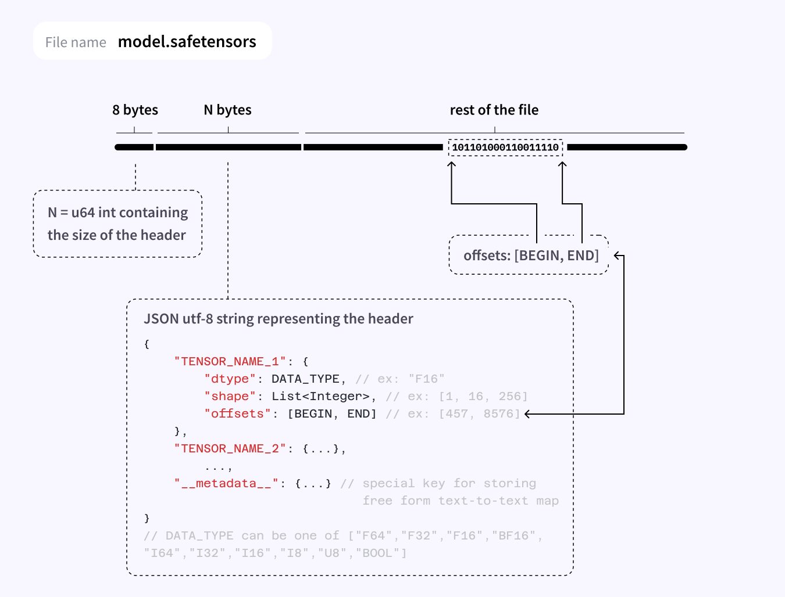

```{r setup, include=FALSE}
knitr::opts_chunk$set(echo = TRUE, eval = FALSE, fig.width = 6, fig.height = 6)
```

safetensors is a new, simple, fast, and safe [file format](https://huggingface.co/docs/safetensors/index) for storing tensors. The design of the file format and its original implementation are being led 
by Hugging Face, and it's getting [largely adopted](https://huggingface.co/blog/safetensors-security-audit#going-forward) in their popular 'transformers' framework. The safetensors R package is a pure-R implementation, allowing to both read and write safetensor files.

The initial version (0.1.0) of safetensors is now on CRAN.

## Motivation

The main motivation for safetensors in the Python community is security. As noted 
in the [official documentation](https://github.com/huggingface/safetensors#yet-another-format-):

> The main rationale for this crate is to remove the need to use pickle on PyTorch which is used by default.

Pickle is considered an unsafe format, as the action of loading a Pickle file can
trigger the execution of arbitrary code. This has never been a concern for torch
for R users, since the Pickle parser that is included in LibTorch only supports a subset
of the Pickle format, which doesn't include executing code.

However, the file format has additional advantages over other commonly used formats, including:

- Support for lazy loading: You can choose to read a subset of the tensors stored in the file.
  
- Zero copy: Reading the file does not require more memory than the file itself. 
  (Technically the current R implementation does makes a single copy, but that can
  be optimized out if we really need it at some point).
  
- Simple: Implementing the file format is simple, and doesn't require complex dependencies. 
  This means that it's a good format for exchanging tensors between ML frameworks and 
  between different programming languages. For instance, you can write a safetensors file
  in R and load it in Python, and vice-versa.
  
There are additional advantages compared to other file formats common in this space, and
you can see a comparison table [here](https://github.com/huggingface/safetensors#yet-another-format-).


## Format

The safetensors format is described in the figure below. It's basically a header file
containing some metadata, followed by raw tensor buffers.



## Basic usage

safetensors can be installed from CRAN using:

``` r
install.packages("safetensors")
```

We can then write any named list of torch tensors:

``` r
library(torch)
library(safetensors)

tensors <- list(
  x = torch_randn(10, 10),
  y = torch_ones(10, 10)
)

str(tensors)
#> List of 2
#>  $ x:Float [1:10, 1:10]
#>  $ y:Float [1:10, 1:10]

tmp <- tempfile()
safe_save_file(tensors, tmp)
```

It's possible to pass additional metadata to the saved file by providing a `metadata`
parameter containing a named list.

Reading safetensors files is handled by `safe_load_file`, and it returns the named
list of tensors along with the `metadata` attribute containing the parsed file header.

``` r
tensors <- safe_load_file(tmp)
str(tensors)
#> List of 2
#>  $ x:Float [1:10, 1:10]
#>  $ y:Float [1:10, 1:10]
#>  - attr(*, "metadata")=List of 2
#>   ..$ x:List of 3
#>   .. ..$ shape       : int [1:2] 10 10
#>   .. ..$ dtype       : chr "F32"
#>   .. ..$ data_offsets: int [1:2] 0 400
#>   ..$ y:List of 3
#>   .. ..$ shape       : int [1:2] 10 10
#>   .. ..$ dtype       : chr "F32"
#>   .. ..$ data_offsets: int [1:2] 400 800
#>  - attr(*, "max_offset")= int 929
```

Currently, safetensors only supports writing torch tensors, but we plan to add
support for writing plain R arrays and tensorflow tensors in the future.

## Future directions

The next version of torch will use `safetensors` as its serialization format,
meaning that when calling `torch_save()` on a model, list of tensors, or other
types of objects supported by `torch_save`, you will get a valid safetensors file.

This is an improvement over the previous implementation because:

1. It's much faster. More than 10x for medium sized models. Could be even more for large files.
   This also improves the performance of parallel dataloaders by ~30%.

2. It enhances cross-language and cross-framework compatibility. You can train your model
   in R and use it in Python (and vice-versa), or train your model in tensorflow and run it
   with torch.

If you want to try it out, you can install the development version of torch with:

``` r
remotes::install_github("mlverse/torch")
```


Photo by <a href="https://unsplash.com/@jannerboy62?utm_source=unsplash&utm_medium=referral&utm_content=creditCopyText">Nick Fewings</a> on <a href="https://unsplash.com/photos/4pZu15OeTXA?utm_source=unsplash&utm_medium=referral&utm_content=creditCopyText">Unsplash</a>
  
