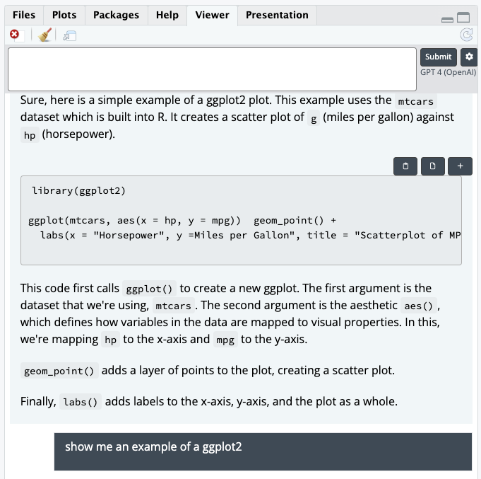
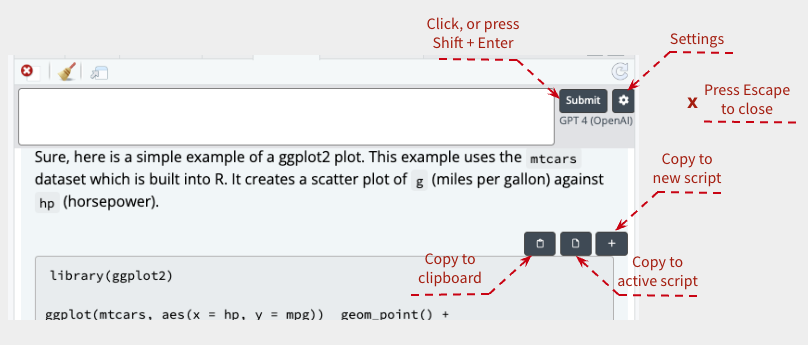
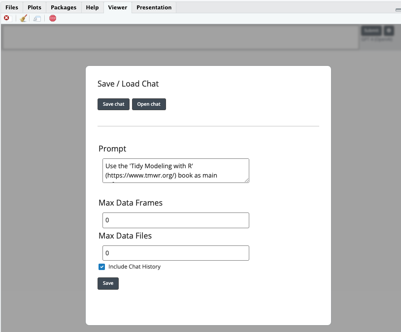
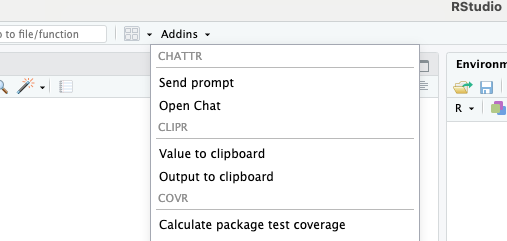

```{r setup, include=FALSE}
knitr::opts_chunk$set(
  echo = TRUE,
  eval = FALSE
  )
```

`chattr` is a package that enables interaction with Large Language Models (LLMs), 
such as GitHub Copilot Chat, and OpenAI's GPT 3.5 and 4. The main vehicle is a
Shiny app that runs inside the RStudio IDE. Here is an example of what it looks
like running inside the Viewer pane:

```{r, echo=FALSE, eval=TRUE, out.width="600px", fig.cap="`chattr`'s Shiny app", fig.alt="Screenshot of the chattr Shiny app, which displays an example of a single interaction with the OpenAI GPT model. I asked for an example of a simple example of a ggplot2, and it returned an example using geom_point()"}

```

Even though this article highlights `chattr`'s integration with the RStudio IDE,
it is worth mentioning that it works outside RStudio, for example the terminal.

## Getting started 

To get started, simply download the package from GitHub, and call the Shiny app
using the `chattr_app()` function:

```r
# Install from GitHub
remotes::install_github("mlverse/chattr")

# Run the app
chattr::chattr_app()

#> ── chattr - Available models 
#> Select the number of the model you would like to use:
#>
#> 1: GitHub - Copilot Chat -  (copilot) 
#>
#> 2: OpenAI - Chat Completions - gpt-3.5-turbo (gpt35) 
#>
#> 3: OpenAI - Chat Completions - gpt-4 (gpt4) 
#>
#> 4: LlamaGPT - ~/ggml-gpt4all-j-v1.3-groovy.bin (llamagpt) 
#>
#>
#> Selection:
>
```

After you select the model you wish to interact with, the app will open. The 
following screenshot provides an overview of the different buttons and 
keyboard shortcuts you can use with the app:

```{r, echo=FALSE, eval=TRUE, out.width="600px", fig.cap="`chattr`'s UI", fig.alt="Screenshot of the chattr Shiny app top portion. The image has several arrows highlighting the different buttons, such as Settings, Copy to Clipboard, and Copy to new script"}

```

You can start writing your requests in the main text box at the top left of the
app. Then submit your question by either clicking on the 'Submit' button, or 
by pressing Shift+Enter.

`chattr` parses the output of the LLM, and displays the code inside chunks. It
also places three buttons at the top of each chunk. One to copy the code to the
clipboard, the other to copy it directly to your active script in RStudio, and 
one to copy the code to a new script. To close the app, press the 'Escape' key.

Pressing the 'Settings' button will open the defaults that the chat session
is using. These can be changed as you see fit. The 'Prompt' text box is
the additional text being sent to the LLM as part of your question. 

```{r, echo=FALSE, eval=TRUE, out.width="600px", fig.cap="`chattr`'s UI - Settings page", fig.alt="Screenshot of the chattr Shiny app Settings page. It shows the Prompt, Max Data Frames, Max Data Files text boxes, and the 'Include chat history' check box"}

```

## Personalized setup

`chattr` will try and identify which models you have setup, 
and will include only those in the selection menu. For Copilot and OpenAI,
`chattr` confirms that there is an available  authentication token in order to
display them in the menu. For example, if you have only have 
OpenAI setup, then the prompt will look something like this:

```r
chattr::chattr_app()
#> ── chattr - Available models 
#> Select the number of the model you would like to use:
#>
#> 2: OpenAI - Chat Completions - gpt-3.5-turbo (gpt35) 
#>
#> 3: OpenAI - Chat Completions - gpt-4 (gpt4) 
#>
#> Selection:
>
```

If you wish to avoid the menu, use the `chattr_use()` function. Here is an example
of setting GPT 4 as the default: 

```r
library(chattr)
chattr_use("gpt4")
chattr_app()
```

You can also select a model by setting the `CHATTR_USE` environment
variable. 

### Advanced customization

It is possible to customize many aspects of your interaction with the LLM. To do
this, use the `chattr_defaults()` function. This function displays and sets the
additional prompt sent to the LLM, the model to be used, determines if the
history of the chat is to be sent to the LLM, and model specific arguments. 

For example, you may wish to change the maximum number of tokens used per response,
for OpenAI you can use this:

``` r
# Default for max_tokens is 1,000
library(chattr)
chattr_use("gpt4")
chattr_defaults(model_arguments = list("max_tokens" = 100))
#> 
#> ── chattr ──────────────────────────────────────────────────────────────────────
#> 
#> ── Defaults for: Default ──
#> 
#> ── Prompt:
#> • {{readLines(system.file('prompt/base.txt', package = 'chattr'))}}
#> 
#> ── Model
#> • Provider: OpenAI - Chat Completions
#> • Path/URL: https://api.openai.com/v1/chat/completions
#> • Model: gpt-4
#> • Label: GPT 4 (OpenAI)
#> 
#> ── Model Arguments:
#> • max_tokens: 100
#> • temperature: 0.01
#> • stream: TRUE
#> 
#> ── Context:
#> Max Data Files: 0
#> Max Data Frames: 0
#> ✔ Chat History
#> ✖ Document contents
```

If you wish to persist your changes to the defaults, use the `chattr_defaults_save()`
function. This will create a yaml file, named 'chattr.yml' by default. If found,
`chattr` will use this file to load all of the defaults, including the selected
model. 

A more extensive description of this feature is available in the `chattr` website
under 
[Modify prompt enhancements](https://mlverse.github.io/chattr/articles/prompt_defaults.html)

## Beyond the app

In addition to the Shiny app, `chattr` offers a couple of other ways to interact
with the LLM:

- Use the `chattr()` function
- Highlight a question in your script, and use it as your prompt

```r
> chattr("how do I remove the legend from a ggplot?")
#> You can remove the legend from a ggplot by adding 
#> `theme(legend.position = "none")` to your ggplot code. 
```

A more detailed article is available in `chattr` website 
[here](https://mlverse.github.io/chattr/articles/other-interfaces.html).

## RStudio Add-ins

`chattr` comes with two RStudio add-ins:

- **Send prompt** - It will submit the highlighted question from your script
to the LLM

- **Open Chat** - It will open the `chattr` app as a Shiny gadget

```{r, echo=FALSE, eval=TRUE, out.width="400px", fig.cap="`chattr` add-ins", fig.alt="Screenshot of the chattr addins in RStudio"}

```

You can bind these add-in calls to keyboard shortcuts, making it easy to open the app without having to write
the command every time. To learn how to do that, see the [Keyboard Shortcut](https://mlverse.github.io/chattr/#keyboard-shortcut) section in the
`chattr` official website. 

## Works with local LLMs

Open-source, trained models, that are able to run in your laptop are widely
available today. Instead of integrating with each model individually, `chattr` 
works with **LlamaGPTJ-chat**. This is a lightweight application that communicates 
with a variety of local models. At this time, LlamaGPTJ-chat integrates with the
following families of models:

- **GPT-J** (ggml and gpt4all models)
- **LLaMA** (ggml Vicuna models from Meta)
- **Mosaic Pretrained Transformers (MPT)** 

LlamaGPTJ-chat works right off the terminal. `chattr` integrates with the
application by starting an 'hidden' terminal session. There it initializes the
selected model, and makes it available to start chatting with it. 

To get started, you need to install LlamaGPTJ-chat, and download a compatible
model. More detailed instructions are found
[here](https://mlverse.github.io/chattr/articles/backend-llamagpt.html#installation).

`chattr` looks for the location of the LlamaGPTJ-chat, and the installed model
in a specific folder location in your machine. If your installation paths do 
not match the locations expected by `chattr`, then the *LlamaGPT* will not show 
up in the menu. But that is OK, you can still access it with `chattr_use()`:

``` r
library(chattr)
chattr_use(
  "llamagpt",   
  path = "[path to compiled program]",
  model = "[path to model]"
  )
#> 
#> ── chattr
#> • Provider: LlamaGPT
#> • Path/URL: [path to compiled program]
#> • Model: [path to model]
#> • Label: GPT4ALL 1.3 (LlamaGPT)
```

## Extending `chattr`

`chattr` aims to make it easy for new LLM APIs to be added. `chattr`
has two components, the user-interface (Shiny app and 
`chattr()` function), and the included back-ends (GPT, Copilot, LLamaGPT). 
New back-ends do not need to be added directly in `chattr`. 
If you are a package
developer and would like to take advantage of the `chattr` UI, all you need to do is  define `ch_submit()` method in your package.

The two output requirements for `ch_submit()` are: 

- As the final return value, send the full response from the model you are 
integrating into `chattr`.

- If streaming (`stream` is `TRUE`), output the current output as it is occurring. 
Generally through a `cat()` function call. 

Here is a simple toy example that shows how to create a custom method for
`chattr`: 

``` r
library(chattr)
ch_submit.ch_my_llm <- function(defaults,
                                prompt = NULL,
                                stream = NULL,
                                prompt_build = TRUE,
                                preview = FALSE,
                                ...) {
  # Use `prompt_build` to prepend the prompt
  if(prompt_build) prompt <- paste0("Use the tidyverse\n", prompt)
  # If `preview` is true, return the resulting prompt back
  if(preview) return(prompt)
  llm_response <- paste0("You said this: \n", prompt)
  if(stream) {
    cat(">> Streaming:\n")
    for(i in seq_len(nchar(llm_response))) {
      # If `stream` is true, make sure to `cat()` the current output
      cat(substr(llm_response, i, i))
      Sys.sleep(0.1)
    }
  }
  # Make sure to return the entire output from the LLM at the end
  llm_response
}

chattr_defaults("console", provider = "my llm")
#>
chattr("hello")
#> >> Streaming:
#> You said this: 
#> Use the tidyverse
#> hello
chattr("I can use it right from RStudio", prompt_build = FALSE)
#> >> Streaming:
#> You said this: 
#> I can use it right from RStudio
```

For more detail, please visit the function's reference page, link 
[here](https://mlverse.github.io/chattr/reference/ch_submit.html).

## Feedback welcome

After trying it out, feel free to submit your thoughts or issues in the
`chattr`'s [GitHub repository](https://github.com/mlverse/chattr/issues). 
