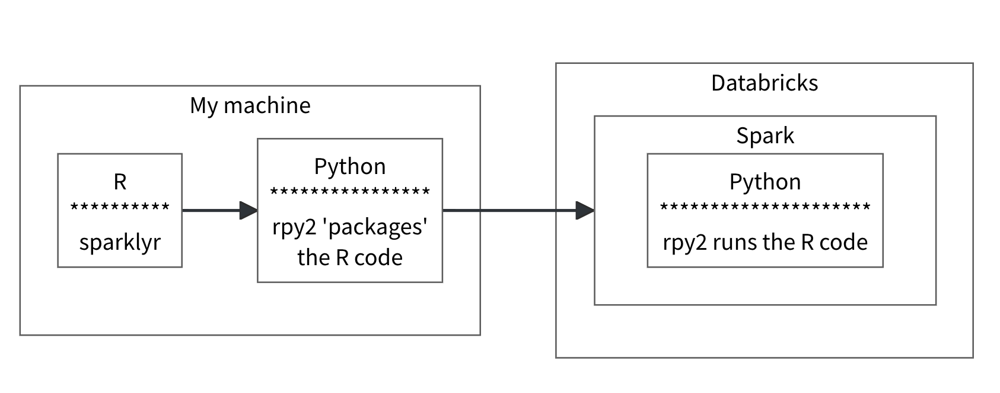

```{r setup, include=FALSE}
knitr::opts_chunk$set(
  echo = TRUE,
  eval = FALSE
  )
```

## Highlights

`sparklyr` and friends have been getting some important updates in the past few
months, here are some highlights:

* Databricks Connect v2 now supports running native R code in Spark, via
`pysparklyr`. 

* `sparkxgb` is coming back to life

* `sparklyr` is leaner and... nicer. It now has less package dependencies, 
and it now only supports Spark 2.4 and above

## pysparklyr 0.1.4

`spark_apply()` now works on Databricks Connect v2. The latest `pysparklyr` 
release uses the `rpy2` Python library as the backbone of the integration.

Databricks Connect v2, is based on Spark Connect. At this time, it supports 
Python user-defined functions (UDFs), but not R user-defined functions. 
Using `rpy2` circumvents this limitation. As shown in the diagram, `sparklyr`
sends the the R code to the locally installed `rpy2`, which in turn sends it
to Spark. Then the `rpy2` installed in the remote Databricks cluster will run 
the R code.


```{r, echo=FALSE, eval=TRUE, out.width="600px", fig.cap="R code via rpy2", fig.alt="Diagram that shows how sparklyr transmits the R code via the rpy2 python package, and how Spark uses it to run the R code"}

```

A big advantage of this approach, is that `rpy2` supports Arrow. In fact it
is the recommended Python library to use when integrating [Spark, Arrow and
R](https://arrow.apache.org/docs/python/integration/python_r.html).
This means that the data exchange between the three languages will be much 
faster!

As in its original implementation, schema inferring works, and as with the
original implementation, it has a performance cost. But unlike the original,
this implementation will return a 'columns' specification that you can use
for the next time you run the call.

A full article about this new capability is available here: 
[Run R inside Databricks Connect](https://spark.posit.co/deployment/databricks-connect-udfs.html)
  
## sparkxgb 

The `sparkxgb` is an extension of `sparklyr`. It enables integration with 
[XGBoost](https://xgboost.readthedocs.io/en/stable/). The current CRAN release
does not support the latest versions of XGBoost. This limitation has recently 
prompted a full refresh of `sparkxgb`. Here is a summary of the improvements,
which are currently in the [development version of the package](https://github.com/rstudio/sparkxgb): 

- The `xgboost_classifier()` and `xgboost_regressor()` functions no longer
pass values of two arguments. These were deprecated by XGBoost and
cause an error if used. In the R function, the arguments will remain for 
backwards compatibility, but will generate an informative error if not left `NULL`:

  - `sketch_eps` - As of [XGBoost version 1.6.0](https://github.com/dmlc/xgboost/blob/59d7b8dc72df7ed942885676964ea0a681d09590/NEWS.md?plain=1#L494)
  `sketch_eps` was replaced by `max_bins`
  - `timeout_request_workers` - Removed in [XGBoost version 1.7.0](https://github.com/dmlc/xgboost/blob/59d7b8dc72df7ed942885676964ea0a681d09590/NEWS.md?plain=1#L398)
because it was no longer needed when XGBoost added barrier support

- It upgrades the version of the XGBoost JAR used during the R session

- Updates code that used deprecated functions from upstream R dependencies. It
also stops using an un-maintained package as a dependency (`forge`). This 
eliminated all of the warnings that were happening when fitting a model. 

- Major improvements to package testing. Unit tests were updated and expanded,
the way `sparkxgb` automatically starts and stops the Spark session for testing 
was modernized, and the continuous integration tests were restored. This will 
ensure the package's health going forward.


## sparklyr 1.8.5

### Fixes

- Fixes quoting issue with `dbplyr` 2.5.0 (#3429)

- Fixes Windows OS identification (#3426)

### Package improvements

- Removes dependency on `tibble`, all calls are now redirected to `dplyr` (#3399)

- Removes dependency on `rapddirs` (#3401): 
  - Backwards compatibility with `sparklyr` 0.5 is no longer needed
  - Replicates selection of cache directory 

- Converts `spark_apply()` to a method (#3418)