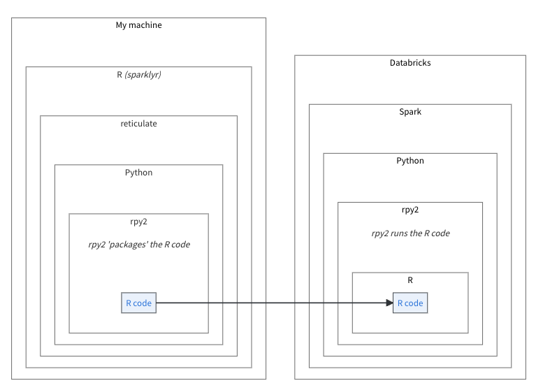

```{r setup, include=FALSE}
knitr::opts_chunk$set(
  echo = TRUE,
  eval = FALSE
  )
```

## Highlights

`sparklyr` and friends have been getting some important updates in the past few
months, here are some highlights:

* `spark_apply()` now works on Databricks Connect v2

* `sparkxgb` is coming back to life

* Support for Spark 2.3 and below has ended

## pysparklyr 0.1.4

`spark_apply()` now works on Databricks Connect v2. The latest `pysparklyr` 
release uses the `rpy2` Python library as the backbone of the integration.

Databricks Connect v2, is based on Spark Connect. At this time, it supports 
Python user-defined functions (UDFs), but not R user-defined functions. 
Using `rpy2` circumvents this limitation. As shown in the diagram, `sparklyr`
sends the the R code to the locally installed `rpy2`, which in turn sends it
to Spark. Then the `rpy2` installed in the remote Databricks cluster will run 
the R code.


```{r, echo=FALSE, eval=TRUE, out.width="600px", fig.cap="R code via rpy2", fig.alt="Diagram that shows how sparklyr transmits the R code via the rpy2 python package, and how Spark uses it to run the R code"}

```

A big advantage of this approach, is that `rpy2` supports Arrow. In fact it
is the recommended Python library to use when integrating [Spark, Arrow and
R](https://arrow.apache.org/docs/python/integration/python_r.html).
This means that the data exchange between the three environments will be much 
faster!

As in its original implementation, schema inferring works, and as with the
original implementation, it has a performance cost. But unlike the original,
this implementation will return a 'columns' specification that you can use
for the next time you run the call.

A full article about this new capability is available here: 
[Run R inside Databricks Connect](https://spark.posit.co/deployment/databricks-connect-udfs.html)
  
## sparkxgb 

The `sparkxgb` is an extension of `sparklyr`. It enables integration with 
[XGBoost](https://xgboost.readthedocs.io/en/stable/). The current CRAN release
does not support the latest versions of XGBoost. This limitation has recently 
prompted a full refresh of `sparkxgb`. Here is a summary of the improvements,
which are currently in the [development version of the package](https://github.com/rstudio/sparkxgb): 

- The `xgboost_classifier()` and `xgboost_regressor()` functions no longer
pass values of two arguments. These were deprecated by XGBoost and
cause an error if used. In the R function, the arguments will remain for 
backwards compatibility, but will generate an informative error if not left `NULL`:

  - `sketch_eps` - As of [XGBoost version 1.6.0](https://github.com/dmlc/xgboost/blob/59d7b8dc72df7ed942885676964ea0a681d09590/NEWS.md?plain=1#L494)
  `sketch_eps` was replaced by `max_bins`
  - `timeout_request_workers` - Removed in [XGBoost version 1.7.0](https://github.com/dmlc/xgboost/blob/59d7b8dc72df7ed942885676964ea0a681d09590/NEWS.md?plain=1#L398)
because it was no longer needed when XGBoost added barrier support

- Updates the JVM version used during the Spark session. It now uses [xgboost4j-spark
version 2.0.3](https://central.sonatype.com/artifact/ml.dmlc/xgboost4j-spark_2.12), 
instead of 0.8.1. This gives us access to XGboost's most recent Spark code. 

- Updates code that used deprecated functions from upstream R dependencies. It
also stops using an un-maintained package as a dependency (`forge`). This 
eliminated all of the warnings that were happening when fitting a model. 

- Major improvements to package testing. Unit tests were updated and expanded,
the way `sparkxgb` automatically starts and stops the Spark session for testing 
was modernized, and the continuous integration tests were restored. This will 
ensure the package's health going forward.

## sparklyr 1.8.5

The new version of `sparklyr` does not have user facing improvements. But 
internally, it has crossed an important milestone. Support for Spark version 2.3 
and below has effectively ended. The Scala
code needed to do so is no longer part of the package. As per Spark's versioning
policy, [found here](https://spark.apache.org/versioning-policy.html), 
Spark 2.3 was 'end-of-life' in 2018. 

This is part of a larger, and ongoing effort 
to make the immense code-base of  `sparklyr` a little easier to maintain, and hence 
reduce the risk of failures. As part of the same effort, the number of upstream
packages that `sparklyr` depends on have been reduced. This has been happening
across multiple CRAN releases, and in this latest release `tibble`, and `rappdirs`
are no longer imported by `sparklyr`. 

