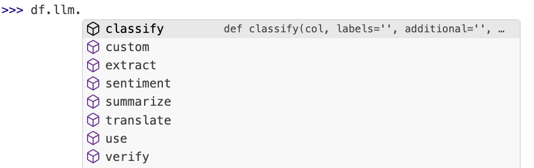

## The beginning

A few months ago, while working on the Databricks with R workshop, I came
across some of their custom SQL functions. These particular functions are
prefixed with "ai_", and they run NLP with a simple SQL call:

```sql
> SELECT ai_analyze_sentiment('I am happy');
  positive

> SELECT ai_analyze_sentiment('I am sad');
  negative
```

This was a revelation to me. It showcased a new way to use
LLMs in our daily work as analysts. Historically, LLMs have been primarily 
employed for code  completion and development tasks. However, this new approach 
focuses on using LLMs directly against our data instead.


My first reaction was to try and access the custom functions via R. With
[`dbplyr`](https://github.com/tidyverse/dbplyr) we can access SQL functions
in R, and it was great to see them work:

```r
orders |>
  mutate(
    sentiment = ai_analyze_sentiment(o_comment)
  )
#> # Source:   SQL [6 x 2]
#>   o_comment                   sentiment
#>   <chr>                        <chr>    
#> 1 ", pending theodolites …    neutral  
#> 2 "uriously special foxes …   neutral  
#> 3 "sleep. courts after the …  neutral  
#> 4 "ess foxes may sleep …      neutral  
#> 5 "ts wake blithely unusual … mixed    
#> 6 "hins sleep. fluffily …     neutral
```

One downside of this integration is that even though accessible through R, we 
require a live connection to Databricks in order to utilize an LLM in this 
manner, thereby limiting the number of people who can benefit from it.

According to their documentation, Databricks is leveraging the Llama 3.1 70B 
model. While this is a highly effective Large Language Model, its enormous size 
poses a significant challenge for most users' machines, making it impractical 
to run on standard hardware.

## Reaching viability

LLM development has been accelerating at a rapid pace. Initially, only online 
Large Language Models (LLMs) were viable for daily use. This sparked concerns among 
companies hesitant to share their data externally. Moreover, the cost of using 
LLMs online can be substantial, per-token charges can add up quickly.

The ideal solution would be to integrate an LLM into our own systems, requiring 
three essential components:

1. A model that can fit comfortably in memory 
1. A model that achieves sufficient accuracy for NLP tasks 
1. An intuitive interface between the model and the user's laptop

In the past year, having all three of these elements was nearly impossible.
Models capable of fitting in-memory were either inaccurate or excessively slow. 
However, recent advancements, such as [Llama from Meta](https://www.llama.com/) 
and cross-platform interaction engines like [Ollama](https://ollama.com/), have
made it feasible to deploy these models, offering a promising solution for
companies looking to integrate LLMs into their workflows.

## The project

This project started as an exploration, driven by my interest in leveraging a 
"general-purpose" LLM to produce results comparable to those from Databricks AI
functions. The primary challenge was determining how much setup and preparation 
would be required for such a model to deliver reliable and consistent results.

Without access to a design document or open-source code, I relied solely on the 
LLM's output as a testing ground. This presented several obstacles, including 
the numerous options available for fine-tuning the model. Even within prompt 
engineering, the possibilities are vast. To ensure the model was not too 
specialized or focused on a specific subject or outcome, I needed to strike a
delicate balance between accuracy and generality.

Fortunately, after conducting extensive testing, I discovered that a simple 
"one-shot" prompt yielded the best results. By "best," I mean that the answers 
were both accurate for a given row and consistent across multiple rows. 
Consistency was crucial, as it meant providing answers that were one of the 
specified options (positive, negative, or neutral), without any additional 
explanations.

The following is an example of a prompt that worked reliably against 
Llama 3.2:

```
>>> You are a helpful sentiment engine. Return only one of the 
... following answers: positive, negative, neutral. No capitalization. 
... No explanations. The answer is based on the following text: 
... I am happy
positive
```

As a side note, my attempts to submit multiple rows at once proved unsuccessful. 
In fact, I spent a significant amount of time exploring different approaches, 
such as submitting 10 or 2 rows simultaneously, formatting them in JSON or 
CSV formats. The results were often inconsistent, and it didn't seem to accelerate
the process enough to be worth the effort.

Once I became comfortable with the approach, the next step was wrapping the 
functionality within an R package.

## The approach

One of my goals was to make the mall package as "ergonomic" as possible. In 
other words, I wanted to ensure that using the package in R and Python 
integrates seamlessly with how data analysts use their preferred language on a
daily basis.

For R, this was relatively straightforward. I simply needed to verify that the 
functions worked well with pipes (`%>%` and `|>`) and could be easily 
incorporated into packages like those in the `tidyverse`:

```r
reviews |> 
  llm_sentiment(review) |> 
  filter(.sentiment == "positive") |> 
  select(review) 
#>                                                               review
#> 1 This has been the best TV I've ever used. Great screen, and sound.
```

However, for Python, being a non-native language for me, meant that I had to adapt my 
thinking about data manipulation. Specifically, I learned that in Python, 
objects (like pandas DataFrames) "contain" transformation functions by design.

This insight led me to investigate if the Pandas API allows for extensions, 
and fortunately, it did! After exploring the possibilities, I decided to start
with Polar, which allowed me to extend its API by creating a new namespace.
This simple addition enabled users to easily access the necessary functions:

```python
>>> import polars as pl
>>> import mall
>>> df = pl.DataFrame(dict(x = ["I am happy", "I am sad"]))
>>> df.llm.sentiment("x")
shape: (2, 2)
┌────────────┬───────────┐
│ x          ┆ sentiment │
│ ---        ┆ ---       │
│ str        ┆ str       │
╞════════════╪═══════════╡
│ I am happy ┆ positive  │
│ I am sad   ┆ negative  │
└────────────┴───────────┘
```

By keeping all the new functions within the llm namespace, it becomes very easy 
for users to find and utilize the ones they need:



## What's next

I think it will be easier to know what is to come for `mall` once the community
uses it and provides feedback. I anticipate that adding more LLM back ends will
be the main request. The other possible enhancement will be when new updated
models are available, then the prompts may need to be updated for that given
model. I experienced this going from LLama 3.1 to Llama 3.2. There was a need
to tweak one of the prompts. The package is structured in a way the future
tweaks like that will be additions to the package, and not replacements to the
prompts, so as to retains backwards compatibility.

This is the first time I write an article about the history and structure of a
project. This particular effort was so unique because of the R + Python, and the
LLM aspects of it, that I figured it is worth sharing. 

If you wish to learn more about `mall`, feel free to visit its official site: 
https://mlverse.github.io/mall/


