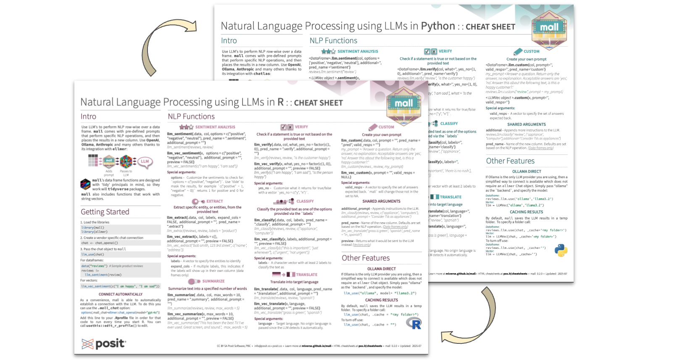
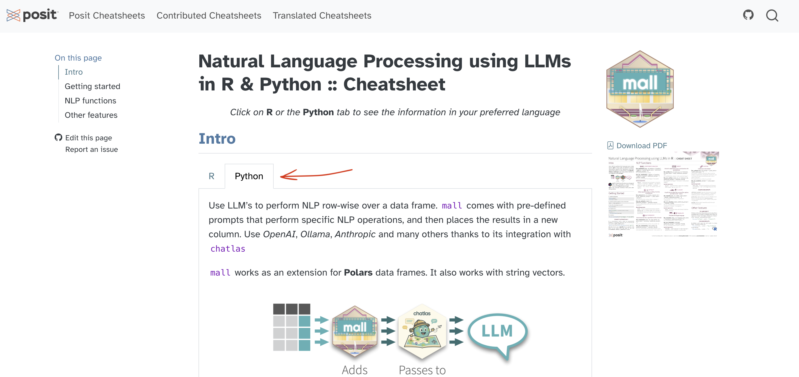

[mall](https://mlverse.github.io/mall/) uses Large Language Models (LLM) to run 
Natural Language Processing (NLP) operations against your data. This package
is available for both R, and Python. Version 0.2.0 has been released to
[CRAN](https://cran.r-project.org/web/packages/mall/index.html) and 
[PyPi](https://pypi.org/project/mlverse-mall/) respectively.

In R, you can install the latest version with:

```r
install.packages("mall")
```

In Python, with:

``` python
pip install mlverse-mall
```

This release expands the number of LLM providers you can use with `mall`. Also,
in Python it introduces the option to run the NLP operations over string vectors,
and in R, it enables support for 'parallelized' requests. 

It is also very exciting to announce a brand new cheatsheet for this package. It
is available in print (PDF) and HTML format! 

## More LLM providers

The biggest highlight of this release is the the ability to use external LLM 
providers such as [OpenAI](https://openai.com/), [Gemini](https://gemini.google.com/) 
and [Anthropic](https://www.anthropic.com/). Instead of writing integration for
each provider one by one, `mall` uses specialized integration packages to act as 
intermediates. 

In R, `mall` uses the [`ellmer`](https://ellmer.tidyverse.org/index.html) package
to integrate with [a variety of LLM providers](https://ellmer.tidyverse.org/reference/index.html#chatbots).
To access the new feature, first create a chat connection, and then pass that 
connection to `llm_use()`. Here is an example of connecting and using OpenAI: 

```r
install.packages("ellmer")

library(mall)
library(ellmer)

chat <- chat_openai()
#> Using model = "gpt-4.1".

llm_use(chat, .cache = "_my_cache")
#> 
#> ── mall session object 
#> Backend: ellmerLLM session: model:gpt-4.1R session: cache_folder:_my_cache
```

In Python, `mall` uses [`chatlas`](https://posit-dev.github.io/chatlas/) as 
the integration point with the LLM. `chatlas` also integrates with
[several LLM providers](https://posit-dev.github.io/chatlas/reference/#chat-model-providers).
To use, first instantiate a `chatlas` chat connection class, and then pass that
to the [Polars](https://pola.rs/) data frame via the `<DF>.llm.use()` function: 

``` python
pip install chatlas

import mall
from chatlas import ChatOpenAI

chat = ChatOpenAI()

data = mall.MallData
reviews = data.reviews

reviews.llm.use(chat)
#> {'backend': 'chatlas', 'chat': <Chat OpenAI/gpt-4.1 turns=0 tokens=0/0 $0.0>
#> , '_cache': '_mall_cache'}
```

Connecting `mall` to external LLM providers introduces a consideration of cost.
Most providers charge for the use of their API, so there is a potential that a 
large table, with long texts, could be an expensive operation. 

## Parallel requests (R only)

A new feature introduced in [`ellmer` 0.3.0](https://www.tidyverse.org/blog/2025/07/ellmer-0-3-0)
enables the access to submit multiple prompts in parallel, rather than in sequence.
This makes it faster, and potentially cheaper, to process a table. If the provider
supports this feature, `ellmer` is able to leverage it via the 
[`parallel_chat()`](https://ellmer.tidyverse.org/reference/parallel_chat.html)
function. Gemini and OpenAI support the feature.

In the new release of `mall`, the integration with `ellmer` has been specially 
written to take advantage of parallel chat. The internals have been re-written to
submit the NLP-specific instructions as a system message in order
reduce the size of each prompt. Additionally, the cache system has also been
re-tooled to support batched requests.

## NLP operations without a table

Since its initial version, `mall` has provided the ability for R users to perform
the NLP operations over a string vector, in other words, without needing a table.
Starting with the new release, `mall` also provides this same functionality 
in its Python version.

`mall` can process vectors contained in a `list` object. To use, initialize a 
new `LLMVec` class object with either an Ollama model, or a `chatlas` `Chat` 
object, and then access the same NLP functions as the Polars extension.

```python
# Initialize a Chat object
from chatlas import ChatOllama
chat = ChatOllama(model = "llama3.2")

# Pass it to a new LLMVec
from mall import LLMVec
llm = LLMVec(chat)    
```

Access the functions via the new LLMVec object, and pass the text to be processed.

```python
llm.sentiment(["I am happy", "I am sad"])
#> ['positive', 'negative']

llm.translate(["Este es el mejor dia!"], "english")
#> ['This is the best day!']
```

For more information visit the reference page: [LLMVec](https://mlverse.github.io/mall/reference/LlmVec.html)

## New cheatsheet

The brand new official cheatsheet is now available from Posit: 
[Natural Language processing using LLMs in R/Python](https://rstudio.github.io/cheatsheets/nlp-with-llms.pdf).
Its mean feature is that one side of the page is dedicated to the R version,
and the other side of the page to the Python version. 



An web page version is also availabe in the official cheatsheet site 
[here](https://rstudio.github.io/cheatsheets/html/nlp-with-llms.html). It takes
advantage of the tab feature that lets you select between R and Python 
explanations and examples.



